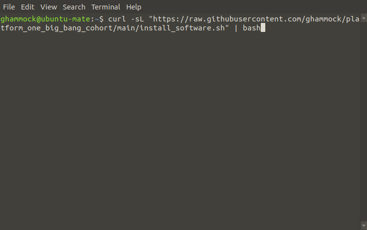
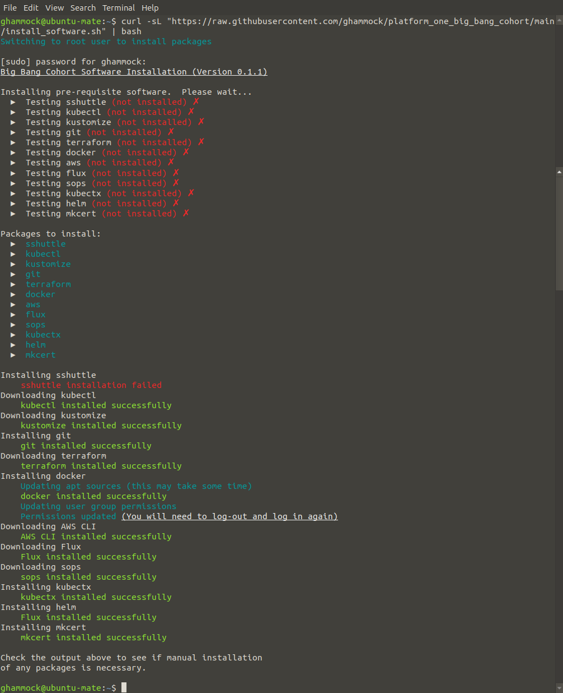
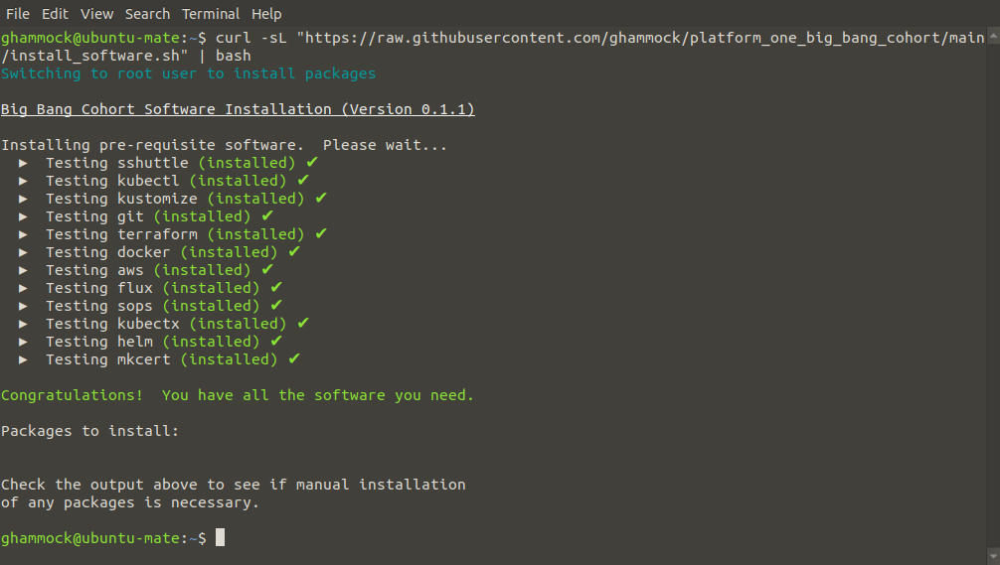

# Platform One Big Bang Cohort

A small repo to aid with the Platform One Big Bang workshops

## Software Installation

### Easy way with `bash` pipe

**Piping into `bash` is dangerous, make sure you understand the risks before copy and pasting code that pipes
into `bash`.**

After understanding what the script will do, copy and paste this command into the terminal of your choice:

```bash
curl -sL "https://raw.githubusercontent.com/ghammock/platform_one_big_bang_cohort/main/install_software.sh" | bash
```

The script will prompt for elevated (`sudo`) permissions, install prerequisites, and then install the necessary
software.

### Alternative Installation

Download the file `install_software.sh` to a location of your choice (e.g. `Downloads`).  In a terminal, navigate to
the downloaded file location and perform the following steps:

```bash
chmod +x install_software.sh
sudo ./install_software.sh
```

If you forget to run the script with `sudo` or root access, it will prompt you to elevate the script permissions.

### Screenshots

#### Piping into bash



#### Installing the software



#### All software installed successfully



## Dependencies

The following packages are required and are available from your Linux distribution's Package Manager:

- apt-transport-https
- ca-certificates
- curl
- gnupg
- libnss3-tools
- lsb-release
- openssl
- python3
- python3-pip
- unzip

## List of Installed Software

The following list shows the software that is installed as well as a description of the capability
that each package provides.

- [sshuttle](https://sshuttle.readthedocs.io/en/latest/index.html) — A proxy/VPN for SSH
- [kubectl](https://kubectl.docs.kubernetes.io/guides/introduction/kubectl/) — The Command Line Interface (CLI)
  for Kubernetes
- [kustomize](https://kubectl.docs.kubernetes.io/guides/introduction/kustomize/) — Provides customization to Kubernetes
  resources without templating or a Domain-Specific Language (DSL)
- [Git](https://git-scm.com/) — Version Control Software
- [Terraform](https://www.terraform.io/) — Infrastructure as Code (IaC)
- [Docker](https://docs.docker.com/get-started/overview/) — Container orchestration
- [AWS CLI](https://aws.amazon.com/cli/) — Amazon Web Services (AWS) CLI
- [Flux](https://fluxcd.io/) — Continuous Delivery (CD) for Kubernetes
- [Mozilla SOPS](https://github.com/mozilla/sops) — Encrypts/Decrypts files or portions of files that integrates with
  AWS Key Management System (KMS), PGP, and others
- [kubectx](https://github.com/ahmetb/kubectx) — A Kubernetes context switcher that integrates with `kubectl`
- [Helm](https://helm.sh/) — A Package Manager (PM) for Kubernetes
- [mkcert](https://github.com/FiloSottile/mkcert) — A tool for creating locally-trusted certificates for development

## Limitations

The script is currently written to work with `apt`-based Linux distributions (e.g. Ubuntu and Debian).  I'm working
on the mods for `dnf`-based distributions (e.g. CentOS and RedHat/RHEL).

## F.A.Q.s

**Q**. Why does `sshuttle` fail to install?
**A**. I don't know.  This is something to do with the first installation of `python3-pip` where `pip3`
throws an error and refuses to install `sshuttle` (as in the second screenshot).  Re-running the script
seems to fix the error though.

## License

SPDX-License-Identifier: MIT

Copyright © 2021 Gary Hammock

Permission is hereby granted, free of charge, to any person obtaining a copy of this software and associated
documentation files (the "Software"), to deal in the Software without restriction, including without limitation the
rights to use, copy, modify, merge, publish, distribute, sublicense, and/or sell copies of the Software, and to permit
persons to whom the Software is furnished to do so, subject to the following conditions:

The above copyright notice and this permission notice (including the next paragraph) shall be included in all copies
or substantial portions of the Software.

THE SOFTWARE IS PROVIDED "AS IS", WITHOUT WARRANTY OF ANY KIND, EXPRESS OR IMPLIED, INCLUDING BUT NOT LIMITED TO THE
WARRANTIES OF MERCHANTABILITY, FITNESS FOR A PARTICULAR PURPOSE AND NONINFRINGEMENT. IN NO EVENT SHALL THE AUTHORS OR
COPYRIGHT HOLDERS BE LIABLE FOR ANY CLAIM, DAMAGES OR OTHER LIABILITY, WHETHER IN AN ACTION OF CONTRACT, TORT OR
OTHERWISE, ARISING FROM, OUT OF OR IN CONNECTION WITH THE SOFTWARE OR THE USE OR OTHER DEALINGS IN THE SOFTWARE.
